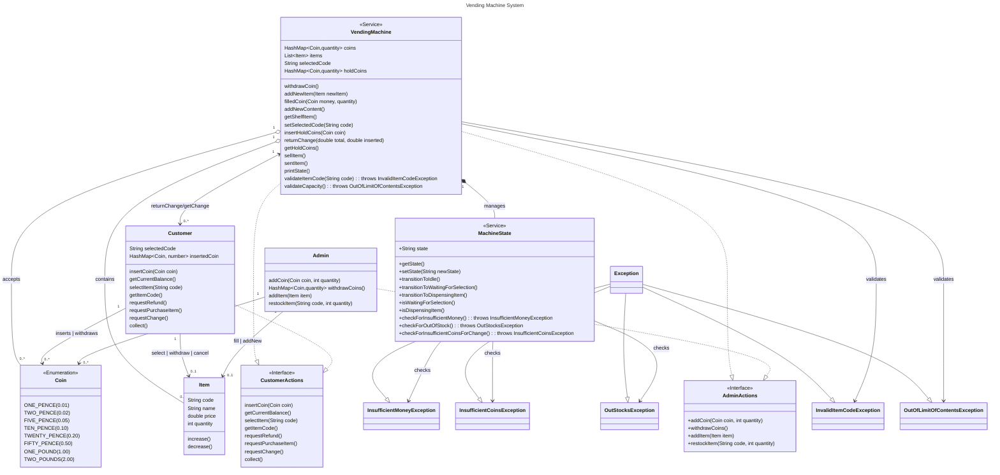

# Java-Assignment-Vending-Machine

This is created for recording the 1st assignment for COMP8710 A1 2024/2025 at the University of Kent.

## Deadline

Wednesday, 6 November 2024, 11:55 PM

## Checklist

- [ ] Functionality of your submission [50%]
  - [ ] support all the requirements
  - [ ] compile and run successfully
  - [ ] perform correctly without crashing with an uncaught exception
- [ ] Object-oriented design [20%] -> how well you designed your classes and interfaces
- [ ] Testing [20%] -> main() method should test all the assignment requirements
  - [ ] create a vending machine
  - [ ] an admin add items and coins to it;
  - [ ] a customer to insert money, purchase items, etc.;
  - [ ] an admin to stock items, withdraw money, etc.. Every step of the way,
  - [ ] *** print what is happening to the terminal, and at the end, print the state of the vending machine.
- [ ] Code quality [10%]
  - [ ] clean and easy to understand
  - [ ] comments and documentation

## Task list

- [x] list Object class
- [x] OOP design
- [/] Complete the code
  - [x] Coin (Enumeration)
  - [ ] CustomerActions (Interface)
  - [ ] AdminActions (Interface)
  - [ ] Customer
  - [ ] Admin
  - [x] Item
  - [ ] VendingMachine (Service)
  - [ ] MachineState (Service)
  - [ ] InsufficientMoneyException
  - [ ] InsufficientCoinsException
  - [ ] OutStocksException
  - [ ] InvalidItemCodeException

## Object Class list

- [x] VendingMachine
  - [x] state
  - [x] return remaining change to a user
- [x] Coin -> Enumeration
  - [x] 2 pounds
  - [x] 1 pound
  - [x] 50 pence
  - [x] 20 pence
  - [x] 10 pence
  - [x] 5 pence
  - [x] 1 penny
- [x] Item
  - [x] code
  - [x] name
  - [x] price
- [x] User
  - [x] purchase item
  - [x] deposit money
  - [x] withdraw the choice (if depositing enough money)
  - [x] cancel their purchase -> withdraw the money the they deposit
- [x] Admin
  - [x] add new item
  - [x] add new content
  - [x] deposit money
  - [x] withdraw money

## OOP design

